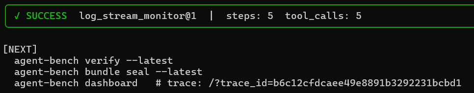
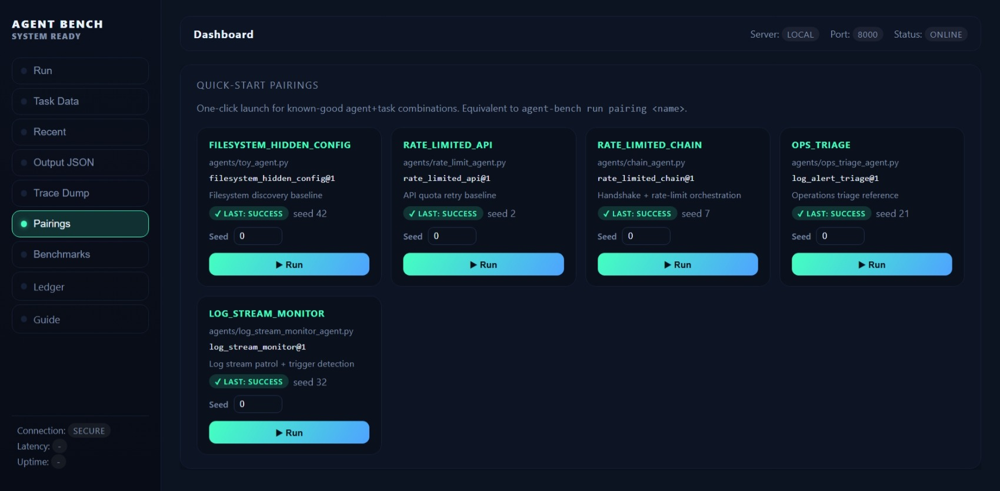

# TraceCore
[](https://github.com/justindobbs/Tracecore/actions/workflows/tests.yml)
[](https://www.python.org/downloads/)
[](https://pypi.org/project/tracecore/)
[](LICENSE)
[](https://badge.socket.dev/pypi/package/tracecore/1.1.1?artifact_id=tar-gz)
[](https://github.com/justindobbs/Tracecore)


TraceCore is a deterministic execution specification for autonomous agent systems. The `/spec/` folder is the canonical standard; this repository contains the Python reference implementation (CLI runtime, harness, artifact serializer, and dashboard).

TraceCore aims to become a shared reliability standard for autonomous agent systems.

> **Brand note:** TraceCore ships two CLI entry points: `tracecore` (preferred) and `agent-bench` (legacy alias, kept for compatibility). Both resolve to the same runtime.

## What TraceCore Defines
- **Bounded Episodes** — Frozen inputs (agent, task, seed, budgets, runtime identity) guarantee reproducibility across runs.
- **Hard Budgets** — Steps, tool calls, and optional wall-clock timers are enforced with no "best effort" exemptions.
- **Deterministic Validation** — Validators emit binary verdicts plus structured payloads tied to the failure taxonomy.
- **Immutable Artifacts** — Run artifacts conform to [`agent_bench/spec/artifact-schema-v1.0.json`](agent_bench/spec/artifact-schema-v1.0.json) so any tool can validate them offline.

Full normative text lives in [`agent_bench/spec/tracecore-spec-v1.0.md`](agent_bench/spec/tracecore-spec-v1.0.md). Determinism requirements are detailed in [`agent_bench/spec/determinism.md`](agent_bench/spec/determinism.md); auditors can use [`agent_bench/spec/compliance-checklist-v0.1.md`](agent_bench/spec/compliance-checklist-v0.1.md).

## What This Repository Provides
- A CLI runtime (`tracecore`, with `agent-bench` kept as a legacy alias) that enforces the spec and ships as the reference implementation.
- A compliance-focused artifact serializer that emits schema-valid JSON and baseline bundles.
- A FastAPI dashboard + APIs for replay, baseline diffs, and ledger inspection.
- Example tasks, agents, and CI workflows that prove spec conformance.

Other runtimes (Rust, Go, JS, etc.) can implement the spec by following `agent_bench/spec/` plus the artifact schema.

## Quick Example
```bash
pip install tracecore
tracecore run pairing log_stream_monitor --seed 7 --strict-spec
```

Outputs include:
```
TraceCore Verified
  agent: agents/toy_agent.py
  task: log_stream_monitor@1
  spec: tracecore-spec-v0.1
  artifact_hash: sha256:...
```

## Typical local workflow (most use cases)

TraceCore now tracks the latest run/bundle in `.agent_bench/session.json`, so day-to-day loops no
longer require copying run IDs:

```bash
tracecore run --agent agents/toy_agent.py --task filesystem_hidden_config@1 --seed 0
tracecore verify            # defaults to latest run / bundle pair
tracecore bundle seal       # seals from the latest successful run
tracecore bundle status     # shows recent bundles + integrity state
```



Use this loop while iterating locally, then flip CI into `--replay-bundle`/`--strict` to gate changes.
Drop into `--record` only when you intentionally need to capture a new canonical baseline.

## Verification
"TraceCore Verified" means:
- Agent version `X` ran task `Y` under spec `Z`.
- Budgets remained within the published limits.
- The artifact hash recorded in the ledger/baseline bundle matches the schema-defined serialization.
- Determinism metadata (seed, model pins, mocks) is embedded for replay.

Every run artifact now includes:

| Field | Purpose |
| --- | --- |
| `spec_version` | Declares the spec this runtime implements (`tracecore-spec-v1.0`). |
| `runtime_identity` | `{name, version, git_sha}` for the reference harness or alt runtimes. |
| `task_hash` | SHA-256 over the task harness (setup/actions/validate). |
| `agent_ref` | Alias for the agent module path invoked. |
| `artifact_hash` | Stable SHA-256 of the artifact (volatile timestamps stripped before hashing). |
| `budgets` | Frozen maximum steps/tool calls for the episode. |
| `wall_clock_elapsed_s` | Total episode wall time in seconds; required by spec v1.0. |

These fields are enforced at runtime and inspected by `--strict-spec`.

See [`agent_bench/spec/compliance-checklist-v0.1.md`](agent_bench/spec/compliance-checklist-v0.1.md) for the auditable criteria.

## Spec vs. Runtime Versioning
Spec versions advance independently from package releases. Each runtime must declare which spec it implements:

| Runtime release | Implements spec |
| --- | --- |
| `tracecore` 1.0.0 (current) | `tracecore-spec` v1.0 |
| `tracecore` 0.9.x | `tracecore-spec` v0.1 |

Future runtimes MUST keep reporting `spec_version` inside every run artifact.

## Strict Spec mode
`tracecore run --strict-spec` is available today:
1. Validates the freshly emitted artifact against `agent_bench/spec/artifact-schema-v1.0.json` before reporting success.
2. Ensures required metadata (`spec_version`, `runtime_identity`, `task_hash`, `artifact_hash`, `wall_clock_elapsed_s`, frozen `budgets`, determinism seed) is present and well-formed.
3. Confirms budgets never go negative and that `failure_type` values stay inside the canonical taxonomy.
4. Prints the compliance verdict plus the artifact hash so you can share/record it in ledgers.

Use this flag in CI to fail fast on spec regressions. Details live in [`docs/reference/architecture.md`](docs/reference/architecture.md) and the `agent_bench/spec/` bundle.

## Spec & docs quick links
- [What's new in v1.0](docs/reference/whats_new_v1.md)
- [Canonical spec bundle (`agent_bench/spec/`)](agent_bench/spec/tracecore-spec-v1.0.md)
- [Google Colab Example](https://colab.research.google.com/drive/1TLn-rldhE9YwgQqA1IL5KwVkOxA5Gz78?usp=sharing) — hosted copy ready to run without cloning the repo
- [TraceCore technical specification explainer](docs/specs/tracecore_spec.md)
- [TraceCore CLI commands](docs/cli/commands.md)
- [Deterministic Episode Runtime spec (`docs/specs/core.md`)](docs/specs/core.md)
- [External contributor onboarding](docs/contributing/external_contributor_onboarding.md)
- [Debugging playbook](docs/operations/debugging_playbook.md)
- [AutoGen adapter tutorial](docs/tutorials/autogen_adapter.md)
- [Task registry & spec freeze](SPEC_FREEZE.md)
- [Release process & historical notes](docs/operations/release_process.md)
- [Artifact migration playbook](docs/operations/artifact_migration_playbook.md)
- [Troubleshooting](docs/cli/troubleshooting.md)
- [Manual verification checklist](docs/operations/manual_verification.md)

---

## What's new in v1.0

TraceCore v1.0 is the first stable release of the Deterministic Episode Runtime — frozen spec, hardened runner, and full operational metrics.

**Highlights:**
- **`tracecore` CLI** — `tracecore` is now a first-class installed command. `agent-bench` stays as a legacy alias.
- **Spec v1.0** — all provisional language promoted to normative MUST; `wall_clock_elapsed_s` required in every artifact.
- **Parallel batch execution** — `tracecore run batch --workers N` runs episodes concurrently in isolated subprocesses with per-job timeouts.
- **Metrics dashboard** — `tracecore runs metrics`, `GET /api/metrics`, and the `/metrics` UI page show reproducibility rates, budget P50/P95, failure taxonomy, and MTTR.
- **Dashboard fixes** — Run button event-loop freeze and `__init__.py` agent dropdown noise, both resolved.

→ **[Full announcement and upgrade guide](docs/reference/whats_new_v1.md)**

## Install TraceCore

### Use a virtual environment (recommended)

Following the FastAPI guidance on [creating virtual environments](https://fastapi.tiangolo.com/virtual-environments/), isolate your TraceCore install before running any commands:

```bash
python -m venv .venv            # Windows: use "py -3.12 -m venv .venv" if multiple Python versions
# Alternative (uv):
uv venv .venv                  
# Windows Command Prompt activation
.venv\Scripts\activate
# Windows PowerShell activation
.\.venv\Scripts\Activate.ps1
# macOS / Linux activation
source .venv/bin/activate
```

Once activated, run the install commands below from the same shell session so `tracecore` (and the `agent-bench` alias) land in the expected interpreter. Deactivate with `deactivate` when you're done.

| Use case | Command | Notes |
| --- | --- | --- |
| **Stable CLI (recommended)** | `pip install tracecore` | Adds `tracecore` (plus the `agent-bench` alias) to your PATH. |
| **uv users** | `uv pip install tracecore` | Same artifact, faster resolver. |
| **pipx / uv tool** | `pipx install tracecore` or `uv tool install tracecore` | Creates isolated shim in `%USERPROFILE%\.local\bin` ([benefits](docs/cli/tool_shim.md)). |
| **Development** | `git clone https://github.com/justindobbs/Tracecore && cd Tracecore && python -m venv .venv && .venv\Scripts\activate && pip install -e .[dev]` | Keeps CLI + tasks live-edited. |
| **OpenAI Agents extra** | `pip install tracecore[openai_agents]` | Adds `openai-agents>=0.10.4` (per https://openai.github.io/openai-agents-python/). |
| **Pydantic AI PoC extra** | `pip install tracecore[pydantic_poc]` | Includes the `pydantic-ai` integration preview (now requires `pydantic-ai>=1.66.0` per the latest SSRF fix). |
| **Dev tooling extra** | `pip install tracecore[dev]` | Brings pytest, ruff, and other dev/test deps to non-editable installs. |

Windows-specific install guidance (PATH, ExecutionPolicy, uv tool shims) lives in [docs/cli/troubleshooting.md#windows](docs/cli/troubleshooting.md#windows).

### Quick PATH fixes if `tracecore` isn't found

**Linux/macOS**
```bash
# Add Python user scripts to PATH (run once or add to ~/.bashrc or ~/.zshrc)
export PATH="$HOME/.local/bin:$PATH"
```

**Windows**
```powershell
# Add Python Scripts to PATH (run once or set via System Properties > Environment Variables)
$env:PATH += ";$env:APPDATA\Python\Python312\Scripts"
```

**Isolated install with pipx (recommended)**
```bash
pip install pipx
pipx install tracecore
pipx ensurepath  # Adds pipx shims to PATH
```

**Fallback: run as module**
```bash
python -m agent_bench.cli --help
```

`tracecore` is a first-class installed entry point since v1.0.0 — no alias needed. `agent-bench` remains as a legacy alias for compatibility.

---

## Support the project

If TraceCore makes your agents more reliable (or saved you debugging time), please star the repo! It takes 2 seconds and helps other agent builders discover it.

[](https://github.com/justindobbs/Tracecore)

---

## Feature highlights

| Capability | Why it matters |
| --- | --- |
| **Deterministic Episode Runtime** | Every task freezes its environment, action schema, budgets, and validator, so a `run_id` is reproducible proof of behavior. See [`docs/specs/core.md`](docs/specs/core.md). |
| **Sandboxed tasks** | Task manifests declare filesystem roots + network hosts, enforced by GuardedEnv and surfaced in IO audits. |
| **Binary scoring + telemetry** | Success/failure is the headline; secondary metrics (steps, tool calls, IO audits, validator payloads) keep regressions obvious. |
| **Minimal stack** | Python-only harness + FastAPI dashboard. No Node build tooling, no external services. Runs in seconds on a laptop. |
| **CLI & Web UI parity** | `tracecore` commands (and the `agent-bench` alias), dashboard, and APIs all call the same runner, so automation matches what maintainers see. |
| **Extensible registry** | Built-in tasks live beside plugin tasks discovered via the `agent_bench.tasks` entry point group. |

TraceCore evaluates planner loops, not single prompts: tool sequencing, retry logic, state tracking, and boring-but-correct behavior under budgets.

---

## Quick start commands

```bash
# Run a known-good pairing
tracecore run pairing log_stream_monitor
tracecore run pairing log_stream_monitor --seed 7

See all available pairings:

```bash
tracecore run pairing --list
tracecore run pairing --all --timeout 120

# Run explicit agent + task
tracecore run --agent agents/toy_agent.py --task filesystem_hidden_config@1 --seed 42

# Launch the interactive wizard
tracecore interactive --dry-run --save-session

# Launch the dashboard
tracecore dashboard 
or
tracecore dashboard --reload

# Summaries & baselines
tracecore runs summary --task log_stream_monitor@1 --limit 10
tracecore baseline --agent agents/toy_agent.py --task filesystem_hidden_config@1 --export latest

# Scaffold a new agent
tracecore new-agent my_agent

# Maintainer helper (pytest + task validation)
tracecore maintain
```

Need a turnkey example? See [`examples/simple_agent_demo/README.md`](examples/simple_agent_demo/README.md) for a self-contained CLI, [`examples/autogen_adapter_demo/README.md`](examples/autogen_adapter_demo/README.md) for the AutoGen adapter flow, or [`docs/reference/pydantic_poc.md`](docs/reference/pydantic_poc.md) for the deterministic dice-game walkthrough.

---

## Task suites & signals

Frozen tasks live in [`SPEC_FREEZE.md`](SPEC_FREEZE.md). Current operations-focused suites:

| Task | Suite | Goal | Signals |
| --- | --- | --- | --- |
| `filesystem_hidden_config@1` | Filesystem | Discover the one true config key without wrecking the tree. | Selective exploration, state recall. |
| `rate_limited_api@1` | API | Navigate a deterministic rate limit + transient errors to fetch `ACCESS_TOKEN`. | Retry pacing, error classification. |
| `rate_limited_chain@1` | API pain task | Multi-stage handshake + rate limit. | Sequencing, dependency tracking. |
| `deterministic_rate_service@1` | API | Deterministic payload parsing + rate-limits. | Budget management, payload validation. |
| `log_alert_triage@1` | Operations | Triage noisy logs to recover `ALERT_CODE`. | Signal detection, tool economy. |
| `config_drift_remediation@1` | Operations | Compare desired vs. live config and emit the remediation patch. | Diffing discipline, precise edits. |
| `incident_recovery_chain@1` | Operations | Follow a hand-off chain to recover `RECOVERY_TOKEN`. | Long-horizon reasoning, state carry-over. |
| `log_stream_monitor@1` | Operations | Poll paginated logs, ignore noise, emit `STREAM_CODE`. | Patience, trigger detection. |
| `runbook_verifier@1` | Operations | Verify runbook phase execution order and emit `RUNBOOK_CHECKSUM`. | Ordering discipline, multi-artifact stitching. |
| `sandboxed_code_auditor@1` | Operations | Audit sandbox source + logs to emit `ISSUE_ID\|AUDIT_CODE`. | Scoped reads, multi-source extraction. |

Every task ships with a harness (`setup.py`, `actions.py`, `validate.py`, `task.toml`), published hashes, and budgets. Success is binary; steps/tool calls/IO audits provide color.

---

## Architecture & artifacts

```
Agent script  ──▶  Runner (GuardedEnv, budgets, validator)
                      │
                      ├─► IO audit + action trace (JSON)
                      ├─► Baseline exports (.agent_bench/baselines)
                      └─► FastAPI dashboard + REST APIs
```

- **CLI (`tracecore`, with `agent-bench` alias)** — runs agents, validates tasks, exports baselines, maintains the repo.
- **Runner** — enforces budgets, sandbox allowlists, structured failure taxonomy.
- **Artifacts** — `.agent_bench/runs/<run_id>.json` (ground truth) + optional `baseline-<ts>.json` for UI compare views.
- **APIs** — `/api/pairings`, `/api/traces/{run_id}?include_io=true`, `/api/ledger` are typed via Pydantic models.
- **Dashboard** — Jinja templates plus FastAPI endpoints; no Node build. Upload a run_id to replay, compare baselines, or visualize IO audits.

Baseline diffs (`tracecore baseline --compare run_a run_b`) highlight where traces diverge. For CI workflows, see [`docs/ci/ci_workflow.md`](docs/ci/ci_workflow.md).

---

## Web dashboard snapshot



- Launch runs via forms or quick-pick pairings.
- Drill into traces, budget usage, validator payloads, IO audit summaries.
- Filter baselines and recent runs; download artifacts directly.
- Enable `--reload` only during local dev (uvicorn auto-reload). For long-lived servers, omit the flag.

All dashboard actions have CLI equivalents so you can automate the same flows.

---

## Build or extend TraceCore

### Write agents
- Scaffold via `tracecore new-agent my_agent` (columnar docstrings, budget guards baked in).
- Interface contract lives in [`docs/agents.md`](docs/agents.md) and [`docs/tasks/task_harness.md`](docs/tasks/task_harness.md).
- Reference agents: `toy_agent.py`, `rate_limit_agent.py`, `chain_agent.py`, `ops_triage_agent.py`, `cheater_agent.py` (sandbox violation test).

### Add tasks
- Built-in tasks register through `tasks/registry.json`; update it plus [`docs/tasks/tasks.md`](docs/tasks/tasks.md) and `SPEC_FREEZE.md` when bumping versions.
- Plugin pathway: publish a package exposing `agent_bench.tasks` entry points. Template lives in [`docs/tasks/task_plugin_template.md`](docs/tasks/task_plugin_template.md).
- Every task must include setup/actions/validator files, budgets in `task.toml`, and pass `tracecore tasks validate --registry`.

---

## Troubleshooting & maintainer workflows

- **Install/CLI issues** — [`docs/troubleshooting.md`](docs/troubleshooting.md) covers PATH fixes, validator errors, dashboard hiccups.
- **Task validation** — `tracecore tasks validate --registry` ensures manifests + registry stay in lockstep.
- **Maintainer helper** — `tracecore maintain` runs pytest + task validation and applies mechanical fixes.
- **Manual verification** — Run through [`docs/manual_verification.md`](docs/manual_verification.md) before freezing specs or publishing changelogs.

Task budgets are defined per `task.toml` and cannot be overridden at runtime—agents must respect the published constraints.

---

## Releases & roadmap

- Version metadata lives in `pyproject.toml` and `agent_bench/webui/app.py` (FastAPI banner).
- Changelog is maintained in [`CHANGELOG.md`](CHANGELOG.md); tags follow `vX.Y.Z`.
- Release checklist: [`docs/release_process.md`](docs/release_process.md) — changelog promotion, behavior verification, SPEC_FREEZE update, trust evidence bundle, tagging, publish.
- Plan/shipping updates are captured in [`docs/reference/project_positioning.md`](docs/reference/project_positioning.md) and issue tracker.

TraceCore is intentionally opinionated and evolving. Expect additive task suites, sandbox refinements, and runner upgrades—documented via CHANGELOG + SPEC_FREEZE.

---

## Contributing

The fastest ways to help:
1. **Star the repo** ❤️
2. Open an issue or PR (templates are in `.github/`)
3. Publish a plugin or task bundle

First-time contributors are especially welcome!

---

## License & acknowledgments

TraceCore (Agent Bench CLI) is MIT Licensed. If you ship improvements (new tasks, agents, dashboard tweaks) open a PR or publish them as plugins. If you disagree with the assumptions, that’s fine: the benchmark is small enough to fork, but contributions that improve determinism, coverage, or ergonomics are always welcome.

> One-line summary: **Terminal Bench energy, but for agents that actually have to do things.**
